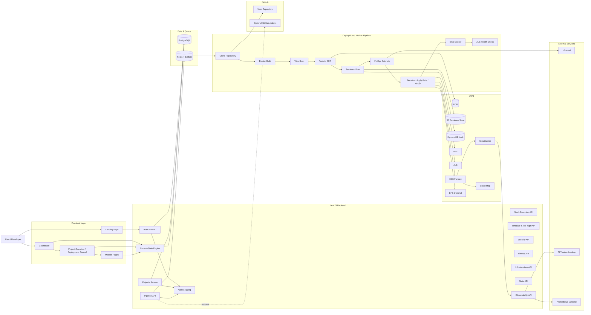
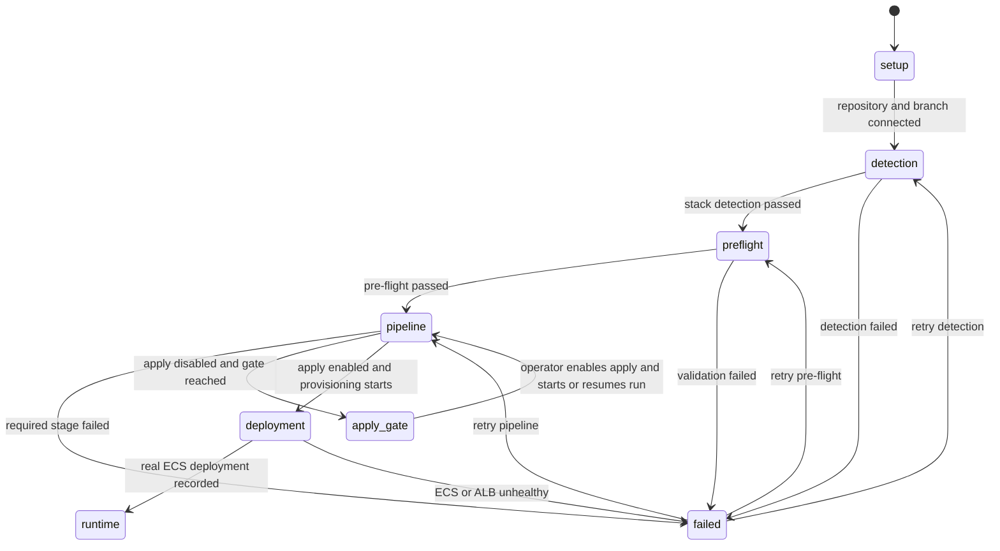
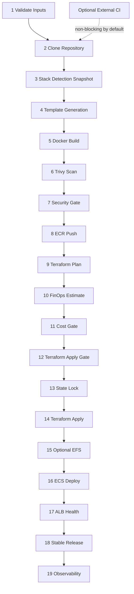

# DeployGuard Product Architecture

Frontend interaction and design-system details are documented in [frontend-architecture.md](./frontend-architecture.md).

DeployGuard is a platform-managed deployment control plane. GitHub supplies source code; DeployGuard owns detection, templates, build, security, cost analysis, infrastructure, deployment, and runtime operations.

Application repositories do not need GitHub Actions, Dockerfiles, docker-compose, Terraform, or AWS credentials. Optional external CI is non-blocking unless an operator explicitly configures `GITHUB_ACTIONS_REQUIRED=true`.

An optional project application directory can constrain detection and builds to a repository-relative monorepo folder. The backend rejects absolute paths and traversal segments; leaving it blank keeps automatic manifest selection.

## Pipeline evidence and runtime logs

Pipeline and Logs have separate ownership. Pipeline presents lifecycle stages, current/failed stage, run controls, and recovery. `/projects/:projectId/logs` presents sanitized structured events for one selected pipeline run, with stage/status filtering. It is deliberately labelled **Pipeline Events** because raw worker stdout/stderr is not persisted. CloudWatch runtime logs remain under the advanced Runtime area and are available only after a real deployment.

## Security gate model

Trivy findings are normalized by origin (`app_dependency`, `base_image`, `os_package`, `unknown`), fixability, and policy effect. Recommended defaults block only fixable Critical application dependencies. High, base-image/OS, and no-fix findings remain visible warnings unless an operator enables stricter policy. Generated Node templates use multi-stage builds, production dependency pruning for server runtimes, non-root users, and an unprivileged nginx runtime for static applications. Python templates isolate installed dependencies in a virtual environment and run as a non-root user.

## High-Level Architecture

## Product Journey and Phase Model

The current-state endpoint determines the user-visible phase. A future disabled stage never changes the present phase. `terraform_apply_gate` becomes a pause only after a real pipeline run reaches it.

## Internal Pipeline and Optional External CI

## Module-to-Product Mapping

| Module | Product surfaces | Authoritative data |
| --- | --- | --- |
| 6.1 Auth & Audit | Landing, auth pages, Audit Logs | Identity, role, login/logout, audited actions |
| 6.2 Projects & Workspace | Dashboard, Create Project, Project Overview | Project, repository, branch, environment variables |
| 6.3 Stack Detection | Project Overview, Detection & Pre-flight | Language, framework, commands, ports, confidence |
| 6.4 Templates & Pre-flight | Detection & Pre-flight, Project Overview | Generated Dockerfile/template and validation |
| 6.5 CI/CD Queue | Pipeline, Project Overview | Queue, runs, stages, events |
| 6.6 Security Scan | Security, Pipeline | Trivy findings and security gate |
| 6.7 FinOps | FinOps, Project Overview | Estimate, tier, approval, mock/real mode |
| 6.8 Infrastructure | Infrastructure | Terraform plan and AWS resource outputs |
| 6.9 Distributed State | State | S3 state, DynamoDB lock, lock lifecycle |
| 6.10 Persistent Storage | Storage | EFS requirement, mount configuration, backup/KMS |
| 6.11 ECS Orchestration | Orchestration, Pipeline | ECS, ALB, rollback, stable release |
| 6.12 Observability | Observability | Logs, metrics, CloudWatch, Prometheus, health |

## Private Repository Production Direction

The MVP can use a backend OAuth token or PAT. Production multi-user private repository support should use short-lived GitHub App installation tokens instead of one backend PAT. Tokens must remain backend-only and must never appear in current-state, event, audit, or frontend payloads.
