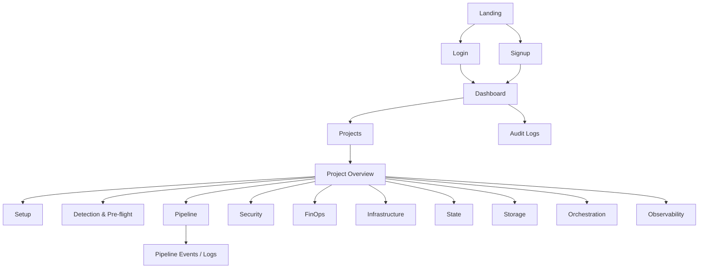

# DeployGuard Frontend Architecture

## Design System Tokens

The frontend uses CSS variables in `frontend/src/styles.css`. Dark mode is the default; `data-theme="light"` overrides the same semantic tokens.

| Token group | Purpose |
| --- | --- |
| `--bg`, `--bg-elevated`, `--surface`, `--surface-muted` | Workspace and component surfaces |
| `--ink`, `--ink-soft`, `--muted` | Primary, secondary, and metadata text |
| `--border`, `--border-strong` | Card, input, table, and navigation boundaries |
| `--accent`, `--accent-soft` | Primary actions and selected navigation |
| `--success`, `--warning`, `--danger`, `--info` | Shared status semantics |
| `--shadow-sm`, `--shadow-md` | Restrained elevation |

Status meanings are consistent: success is passed/deployed, warning is needs-action/paused, danger is attempted failure or enforced blocking, info is active work, and neutral is not-started/skipped/future.

## Page Map

Public landing and authentication pages do not use the authenticated sidebar. Authenticated pages share `AppLayout`, `Sidebar`, `Navbar`, `CommandPalette`, theme state, and toast notifications.

## Shared Component Map

- `Premium.jsx`: headers, badges, metric/readiness cards, lifecycle and activity views, diagnostics disclosure.
- `Sidebar.jsx`: global navigation, project context, workspace switcher.
- `CommandPalette.jsx`: Cmd/Ctrl+K page, project, and contextual-action navigation.
- `ToastContext.jsx`: reusable non-blocking async notifications.
- `LoadingState.jsx`, `EmptyState.jsx`, `ErrorState.jsx`: consistent skeleton, empty, and failure presentation.
- `ProjectModuleStatusStrip.jsx`: current-state context shared by module detail pages.
- `PipelineLiveLogPanel.jsx`: auto-scrolling, copyable view used only by the dedicated Pipeline Events page.

## Current-State-Driven UI Rule

`GET /api/projects/:id/current-state` is authoritative for phase, status, current step, progress, run controls, live deployment outcome, environment modes, lifecycle visibility, module readiness, and recent activity.

Module endpoints supply detail only. Frontend pages must not infer a conflicting project status from an isolated module response.

- Before a pipeline exists, `showFullLifecycle=false`; future stages stay hidden or collapsed.
- Safe Mode is informational before Apply Gate.
- Safe Mode becomes `paused` only after a run reaches `terraform_apply_gate`.
- External CI warning/skipped states remain secondary when optional.
- Runtime observability is presented only after a real ECS deployment exists.
- `POST /api/projects/:id/automation/start` idempotently runs detection and pre-flight, then queues the internal worker.
- `POST /api/projects/:id/pipeline/runs/:runId/cancel` persists cancellation and the worker checks it between stages.
- `POST /api/projects/:id/pipeline/runs/:runId/retry` validates that the selected run is retryable, then starts fresh detection, pre-flight, and a new run through the automation controller.
- The normal product flow does not ask for security or cost approval. Policy failures enter the single recovery area for remediation and retry. Legacy approval endpoints remain available only when `AUTOMATION_MANUAL_APPROVALS_ENABLED=true`.

## Real-Time Update Strategy

- Active Pipeline page: polls current state and run status every four seconds. Events are fetched only to reconstruct an explicitly selected historical run and provide compact failure evidence.
- Pipeline Events page: polls sanitized structured events for one selected active run and supports run, stage, status, and text context.
- Active Project Overview: polls authoritative current state every five seconds.
- CloudWatch logs: existing authenticated SSE stream with manual start/stop.
- Pipeline worker evidence: polling-backed structured events with follow mode, search, level filtering, and copy. Raw worker stdout/stderr is not persisted and is not claimed as available.
- Static module detail pages load on entry; explicit user actions refresh their relevant data.

This deliberately reuses reliable endpoints and avoids adding another real-time transport.

## Module-to-Page Mapping

| Module | Primary pages |
| --- | --- |
| Auth & Audit | Landing, Login, Signup, Audit Logs |
| Projects & Workspace | Dashboard, Projects, Create Project, Project Overview, Setup |
| Stack Detection / Templates | Detection & Pre-flight, Project Overview |
| CI/CD Queue | Pipeline, Pipeline Events, Project Overview |
| Security | Security, Pipeline |
| FinOps | FinOps, Project Overview |
| Infrastructure | Infrastructure |
| Distributed State | State |
| Persistent Storage | Storage |
| ECS Orchestration | Orchestration, Pipeline |
| Observability | Runtime, CloudWatch Logs, Metrics |

## Good and Bad State Examples

Good:

- “Stack detection required before deployment.”
- “Automation paused for security approval.”
- “Deployment paused at Apply Gate after plan and cost approval.”
- “Observability available after ECS deployment.”

Bad:

- “State Lock blocked” before a pipeline starts.
- “ECS blocked” before deployment starts.
- “GitHub Actions failed, pipeline blocked” while external CI is optional.
- Showing future stages as alarming blockers before they are relevant.

## Accessibility and Responsiveness

- Interactive controls use visible focus states and semantic buttons/links.
- Command palette supports Cmd/Ctrl+K, Escape, arrow keys, and Enter.
- Dialog, status, log, progress, and live-notification regions include ARIA semantics.
- Tables remain horizontally scrollable.
- Sidebar collapses into the responsive document flow at smaller widths.
- Reduced-motion preferences disable non-essential transitions and animations.
